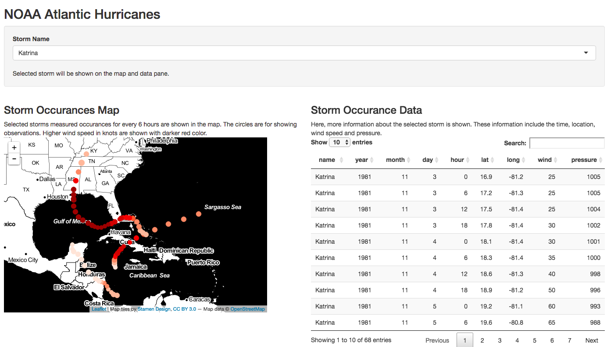

North Atlantic Storm Tracks
========================================================
author: Refik Türkeli
date: 3 July 2017
autosize: true


Introduction
========================================================

The data used is a subset of the NOAA Atlantic hurricane database best track data. The data includes the positions and attributes of 198 tropical storms, measured every six hours during the lifetime of a storm.

The variable names of the data are:

```r
names(storms)
```

```
 [1] "name"        "year"        "month"       "day"         "hour"       
 [6] "lat"         "long"        "status"      "category"    "wind"       
[11] "pressure"    "ts_diameter" "hu_diameter"
```

The number of observations are:

```r
nrow(storms)
```

```
[1] 10010
```

Data Products
========================================================

Shiny application for exploring the data can be found here: 

- [https://refik.shinyapps.io/dpw4/](https://refik.shinyapps.io/dpw4/)

Source code for the application and these slides are also here:

- [https://github.com/refik/dpw4](https://github.com/refik/dpw4)

Shiny Application
========================================================

Shiny application for viewing the data consists of a select box for filtering
the name of the storm, a map for displaying the data tracks and a data table
for showing the details of the track. Selecting different storm name from the
input updates the map and data shown. Full application looks like this:



Histogram of Data Points by Year
========================================================


```r
hist(storms$year, xlab = "Year", ylab = "Data Frequency", main = "Years of Data Collected")
```


